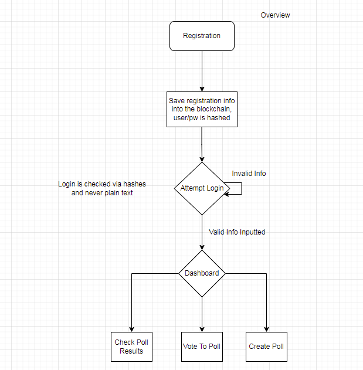
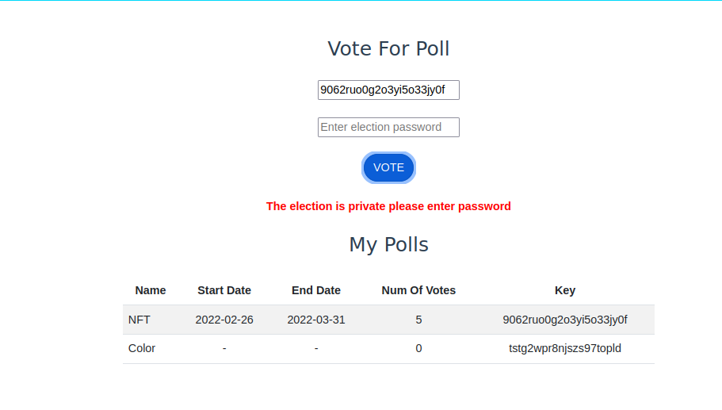
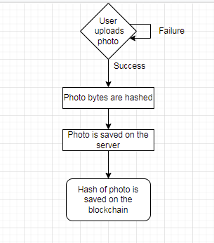
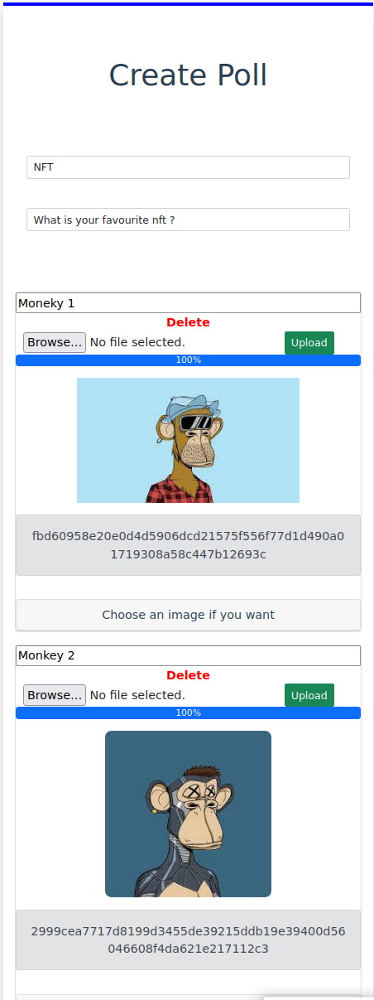
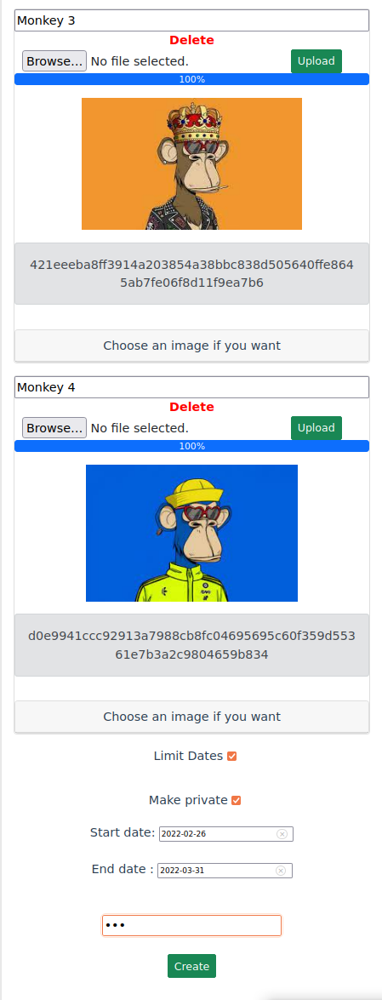
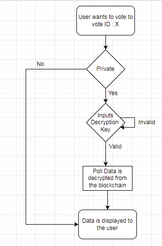
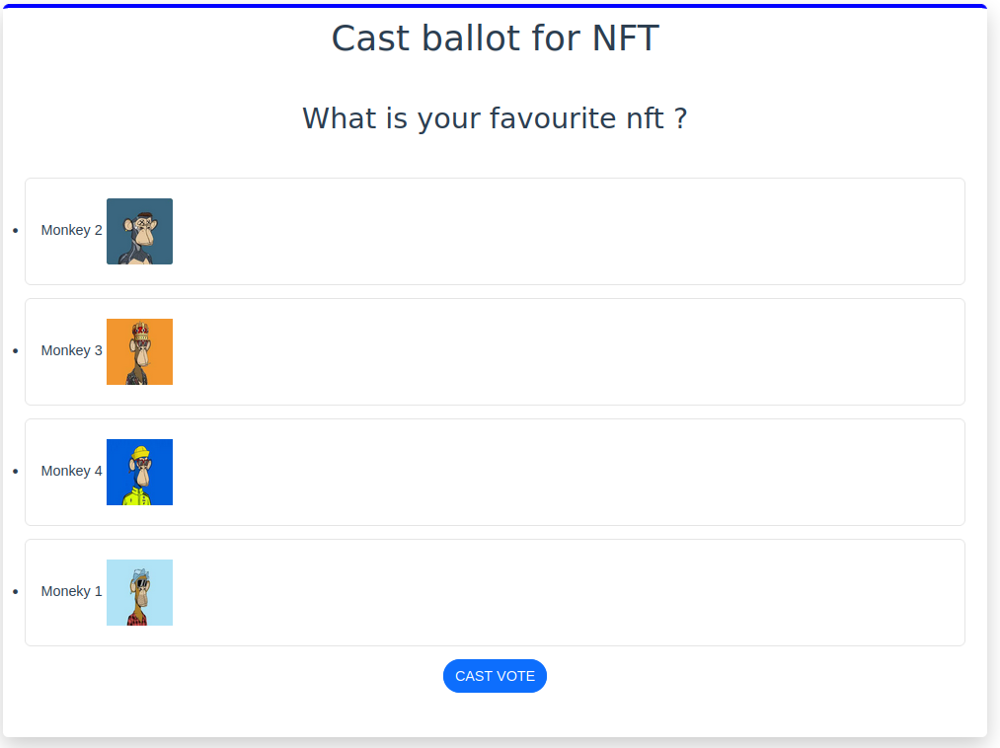

# Evote - based on Hyper Fabric

This project was written as the final project for blockchain course.
this is a web based voting system that utilize blockchain to allow users to register,login,create polls,vote for polls and get stats about the polls results. 

**Featured technologies :**
•	Hyperledger Fabric v2.0  

•	IBM Blockchain Platform v2.0.5 for visual studio

•	Node.js v12.15.0 

•	Vue.js 2.6.10 

•	CSS 

**General overview :**

At the start of the application the user register by providing  :user name ,password ,gender and age .If the registration is successful the user can log in , in his main page he can vote for a poll and also can see all the polls he created and some general information about them.

 
 
Dashboard: 

 

**Create Polls -**

The user can create a poll by pressing the create poll button in the top bar . When creating a poll the user need to provide a question and answers. He can also add an image to any of the answers or to all of them and specify the start and end dates for the poll.
If the user wants he can also choose to create the poll private which means that all of the poll info will be saved encrypted on the blockchain via a specific key that the user inputs.

 
 

  
  
  

**Voting for a poll -**

The user can vote for a poll by entering the poll id . 
If the poll is private the user must provide the key that the was used to create the poll or else he wouldn’t be able to decrypt the data and continue on with the voting.
Each user can only vote once for each poll. After the user casts his vote the poll result will be displayed for him.

  
  
  

**Poll Results -**

The poll result are displayed as charts - each chart displays a different stat about the result – general (number of votes for each choice , percentages for each choice),by gender (how many women and men participated  in the poll and how and if the gender affected the choice ) and by age (how many different groups of age participated  in the poll and how and if the age affected the choice). The user can also see the results by pressing the get current standing button and providing the poll id .

  

